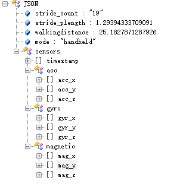

# WalkingDistanceEstimation

The lack of benchmarking datasets for pedestrian SLE makes it hard to pinpoint the differences of published methods. Existing datasets either lack the ground-truth of stride-length and smartphone modes or are limited to small spaces with a single scene. To fully evaluate the performance of proposed SLE algorithm, we conducted benchmark dataset for natural pedestrian dead reckoning using smartphone sensors and FM-INS module (includes a three-axis accelerometer and a three-axis gyroscope). The gyroscope detects the angular motion, and the accelerometer detects the linear motion. The NGIMU’s performance parameters were listed in Table 2. We leveraged NGIMU module to provide the ground-truth of each stride with motion distance errors in 0.3% of the entire travel distance. As shown in Figure 2, the FM-INS module was attached to the right foot. The coordinates of the NGIMU module were defined as follows: the Y-axis along the toe direction; the Z-axis perpendiculars to the foot surface, and the X-axis conforms to the right-hand rule. The motion data were captured using Huawei Mate 9 smartphone which comprised an accelerometer and gyroscope to acquire tri-axial linear acceleration and angular velocity signals at a sampling rate of 100 Hz. The dataset was obtained from a group of healthy adults with natural motion patterns (fast walking, normal walking, slow walking). During data acquisition, collectors randomly changed the smartphone mode while updating the corresponding data label (Handheld, Armhand, Pocket, Calling and Swing). The distributions for the five modes are shown in Figure 3. The datasets contained more than 13.5 km, 10145 strides of gait measurements. To reduce redundancy and maximize compatibility, all the data were published in JSON format. Each sample holds nine degree-of-freedom sensor data and the corresponding stride number, smartphone mode, stride-length and total walking-distance. 

